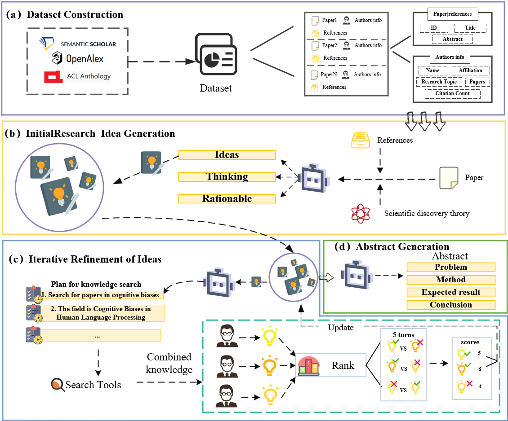

# Enhancing Research Idea Generation through Combinatorial Innovation and Multi-Agent Iterative Search Strategies

##  :key: Introduction

This repository contains the code for our paper "Enhancing Research Idea Generation through Combinatorial Innovation and Multi-Agent Iterative Search Strategies" which had been accepted by [20th INTERNATIONAL CONFERENCE ON SCIENTOMETRICS & INFORMETRICS](https://issi2025.iiap.sci.am/).



- We propose a multi-agent iterative search strategy (multi-domain knowledge fusion + multi-agent discussion) to enhance the performance of large language models in generating scientific research methodologies, while utilizing real-world data for role-playing and conducting objective evaluation of the final outputs.
- We evaluated the strategy based on the novelty and diversity of the generated scientific research ideas. The results demonstrate that the multi-agent iterative search strategy improves output quality, outperforming current state-of-the-art methods.
- The contributions of this study are twofold: (1) achieving creative iteration and optimization through multi-round interactions among functionally specialized agents such as experts and critics, and (2) exploring cross-domain knowledge recombination based on combinatorial innovation theory to stimulate creative breakthroughs.

## 🎥 Demo

[MAGenIdeas Demo](https://huggingface.co/spaces/cshuai20/MAGenIdeas)

<video src="./vedio/vedio.mp4"></video>

## 🛠️ Environment

We recommend using Python version 3.10 or higher.

```bash
cd agentscope-main
pip install -e .
pip install -r requirements.txt
```

## :books: Dataset

The raw data is based on the [Annual Meeting of the Association for Computational Linguistics (2024) - ACL Anthology](https://aclanthology.org/events/acl-2024/#2024acl-long)

After preprocessing, the used data is publicly available at ./dataset/data/acl2024_long


## 📁 Code Structure
Here we explain the roles of several critical files:

- `main/idea_generator.py` - Core implementation of the research idea generation system
- `agentscope-main/src/agentscope/agents/sci_agent.py` - Defines the customized scientist agents, inspired by https://arxiv.org/abs/2410.09403v2
- `utils/prompt.py` - Contains all prompts used by the agents
- `utils/scientist_utils.py` - Common utility functions

## 🚀 Usage
### API Configuration
Configure your DeepSeek API key in the environment variables:
```bash
export DEEPSEEK_API_KEY='your_api_key_here'
```

### Running the System
After setting up the models, run:

**First，generating seed ideas.**

```bash
cd main
python python generate_seed_ideas.py
```

Common arguments:
- `--paper_id`: ID of the paper to process
- `--ideas_num`: Number of ideas to generate

**Then, iterating seed ideas.**

```bash
python python idea_generator.py
```

Common arguments:
- `--idea_ids`: List of idea IDs to process (default [0])
- `--paper_idxs`: List of paper indexes to process (required)
- `--group_max_iteration`: Max discussion iterations (default 3)
- `--num_processes`: Number of parallel processes (default 15)

## 📊 Results
Output files are saved in `virtual_scientists/results/`:

## :mailbox_with_mail:Contact

If you have any questions, please  contact at [shuaichen@njust.edu.cn].

## :pencil2: Citation
Please cite the following paper if you use these codes and datasets in your work.

>Shuai Chen, Chengzhi Zhang*. Enhancing Research Idea Generation through Combinatorial Innovation and Multi-Agent Iterative Search Strategies. In: Proceedings of the 20th International Conference on Scientometrics and Informetrics (ISSI 2025), Yerevan, Armenia, 2025.  [[doi](https://doi.org/10.51408/issi2025_007)] [[Dataset & Source Code]](https://github.com/ChenShuai00/virtual_scientists) 

